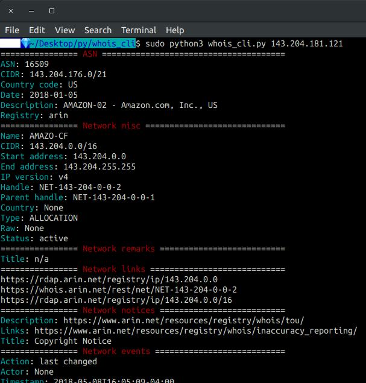

# whois_cli

This repo is made available under MIT license (see `LICENSE`).

`whois_cli.py` was tested in a Unix-like terminal emulator running Bash in [Ubuntu 18.04](http://releases.ubuntu.com/18.04/).

[pip](https://pypi.org/project/pip/) was used for package management.



## requirements.txt

**Note**:

1. since specific Python libraries may be used system-wide in Ubuntu&mdash;to be safe&mdash;a [virtual environment](https://docs.python.org/3/glossary.html#term-virtual-environment) is required.
2. if Ubuntu is using **pip** and **pip2** for Python 2 package management, then **pip3** will be the required package manager.

To install required dependencies:

`$ pip install -r requirements.txt`

```python
dnspython==1.16.0
ipwhois==1.1.0
```

The [sys.argv](https://docs.python.org/3/library/sys.html#sys.argv) method will also be imported.

```python
from ipwhois import IPWhois
from sys import argv
```

## whois_cli.py

`IPWhois(argv[1]).lookup_rdap()`

`ipwhois.IPWhois`
: is the base class for wrapping whois lookups.

`sys.argv[1]`
: gets first command line argument passed to `whois_cli.py` or the IPv4 number.

`IPWhois.lookup_rdap()`
: became the recommended lookup method, since [RDAP](https://www.arin.net/resources/registry/whois/rdap/) provides more efficient, higher quality whois data.

`_objs = w["objects"]`
: indicates that the `objects` dictionary within the whois data will be stored in the `objs` variable.

```python
_asn = {
    "asn": "ASN",
    "asn_cidr": "CIDR",
    "asn_country_code": "Country code",
    "asn_date": "Date",
    "asn_description": "Description",
    "asn_registry": "Registry"
}
```

The dictionary above contains ASN keys with their associated values for capitalized string syntax.

```python
try:
    for k, v in net_remarks.items():
        print(f'{cyan}{v}{end}: {_net["remarks"][0][k]}')
except TypeError:
    print(f'{cyan}{v}{end}: n/a')
```

In the `for` loop above, a try/except block was used to handle `None` returns. `n/a` strings replace `None` returns.

## Color Formatting

```python
red = "\x1b[0;31m"
cyan = "\x1b[0;36m"
end = "\x1b[0m"
```

Parts of color formatting syntax for text display in the terminal emulator were stored in variables (see above).

```python
print(f'{cyan}{v}{end}: {_net["remarks"][0][k]}')
```

`{cyan}{v}{end}` demonstrates the use of f-string expressions to format text colors.

[](https://ko-fi.com/R6R72LISM)
